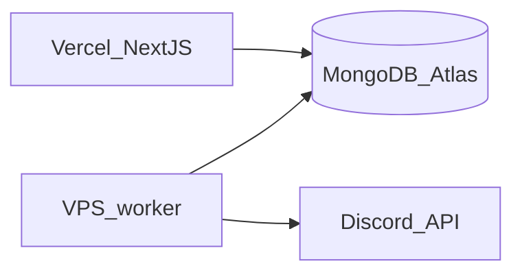

# VPS deployment plan: Discord outbox worker

## Architecture (unchanged)



The worker only needs **outbound** HTTPS to Atlas and Discord. No inbound ports are required unless you add a health endpoint later.

## 1. VPS baseline

- **OS**: Current Ubuntu LTS (or Debian) is fine.
- **User**: Dedicated non-root user (e.g. `neblir`) owning the app directory.
- **Software**: `git`, **Node.js 20** (match [package.json](package.json) `engines` if present; otherwise align with local dev), `npm` or `corepack`.
- **Firewall**: Default allow egress; no need to open inbound for this worker.

## 2. Get the code on the server

- Clone the repo (SSH deploy key or HTTPS) into e.g. `/home/neblir/neblir`.
- **Branch**: Deploy the same commit/tag you consider production (often `main`).

## 3. Environment variables

The worker reads `[scripts/discord-outbox-worker.ts](scripts/discord-outbox-worker.ts)`: it loads `.env` then `.env.local` from `process.cwd()`, and **requires** `DISCORD_BOT_TOKEN` at startup. Prisma (via `[prisma/schema.prisma](prisma/schema.prisma)`) uses `**MONGODB_URI`, not `DATABASE_URL`.

**On the VPS, set at minimum:**

| Variable            | Notes                                                                                                                                                                |
| ------------------- | -------------------------------------------------------------------------------------------------------------------------------------------------------------------- |
| `MONGODB_URI`       | **Same production connection string** as Vercel (Atlas cluster user, correct DB name, `retryWrites` etc.).                                                           |
| `DISCORD_BOT_TOKEN` | Bot token only needed here for posting messages (see [docs/discord-dice-roll-broadcasting.md](docs/discord-dice-roll-broadcasting.md) for full app vs worker split). |

**Recommended pattern**: `systemd` `**EnvironmentFile=`** pointing to a root-owned or user-owned file (e.g. `/etc/neblir/discord-worker.env`) with `chmod 600`, **or** a `.env` in the app directory that is **not in git. Avoid committing secrets.

**Optional**: `NODE_ENV=production` (see dependency caveat below).

## 4. Install dependencies and Prisma client

From the repo root on the **Linux** host:

```bash
npm ci
npm run prisma:generate
```

**Important**: `[worker:discord](package.json)` runs `**tsx`**, which lives under **devDependencies**. If you run `NODE_ENV=production npm ci`, devDependencies are skipped and `**npm run worker:discord` will fail. Pick one:

- **Simplest**: On the worker host, run `npm ci` **without** omitting devDependencies (do not set `NODE_ENV=production` for install), **or** use `npm ci --include=dev`.
- **Leaner (optional follow-up)**: Move `tsx` to `dependencies`, or compile the worker to JS and run with `node` only.

## 5. Run the worker under systemd

Create a unit (example names; adjust paths/user):

- `**WorkingDirectory`: repo root (where `node_modules` and `scripts/` live).
- `**ExecStart`**: `/usr/bin/npm run worker:discord` **or `npx tsx scripts/discord-outbox-worker.ts` using the same Node as install.
- `**Restart=always`** and `**RestartSec=5\*\` (or similar) so crashes recover.
- `**User`/`Group`: non-root service user.

The worker already handles **SIGTERM** gracefully (finishes current batch, exits 0) — compatible with `systemctl stop` and deploy restarts. Prefer `**systemctl restart neblir-discord-worker` after deploy rather than `kill -9`.

Example skeleton (paths are illustrative):

```ini
[Unit]
Description=Neblir Discord outbox worker
After=network-online.target

[Service]
Type=simple
User=neblir
WorkingDirectory=/home/neblir/neblir
EnvironmentFile=/etc/neblir/discord-worker.env
ExecStart=/usr/bin/npm run worker:discord
Restart=always
RestartSec=5

[Install]
WantedBy=multi-user.target
```

Then: `sudo systemctl daemon-reload`, `sudo systemctl enable --now neblir-discord-worker`.

## 6. MongoDB Atlas network access

- In Atlas **Network Access**, allow the VPS **outbound IP** (static IP from provider if available; otherwise update when IP changes).
- If the cluster already allows `0.0.0.0/0` with strong credentials (common with serverless app hosts), the VPS works too — still prefer tightening to known IPs when practical.

## 7. Deploy / update procedure

Each release:

1. `git pull` (or your CI artifact).
2. `npm ci` (with dev deps available for `tsx`, per section 4).
3. `npm run prisma:generate` whenever `prisma/schema.prisma` changes.
4. `sudo systemctl restart neblir-discord-worker`.
5. `**journalctl -u neblir-discord-worker -f` to confirm it starts and no `Missing required environment variable` / Prisma errors.

## 8. Operations and safety

- **Single instance**: Run **one** worker process per environment unless you later add stronger idempotency; the current claim pattern assumes a single consumer is the normal case.
- **Logs**: Prisma client in [src/app/lib/prisma/client.ts](src/app/lib/prisma/client.ts) logs queries in all environments — expect noisy logs on the VPS; you may later set `NODE_ENV=production` and adjust Prisma `log` for quieter production (optional code change, not required for first deploy).
- **Failure modes**: Documented in [docs/discord-dice-roll-broadcasting.md](docs/discord-dice-roll-broadcasting.md) — stale `PROCESSING` reclaim, `DEAD_LETTER`, `DEGRADED` integration.

## 9. Verification checklist

- Service is **active (running)** after boot (`systemctl is-active`).
- Trigger a roll in production (or staging): message appears in Discord within ~poll interval (`[POLL_MS` is 2s](scripts/discord-outbox-worker.ts) in your tree).
- `systemctl stop` then `start`: worker recovers; no permanent stuck queue (reclaim covers hard kills after 5 minutes).

## Optional later improvements (out of scope unless you want them)

- **Docker**: Same steps inside a container; still one replica, same env.
- **CI**: SSH + `git pull` + restart, or build an image and roll out.
- **Monitoring**: Uptime ping or alert on `DiscordOutbox` stuck counts / `DEAD_LETTER` rate.
